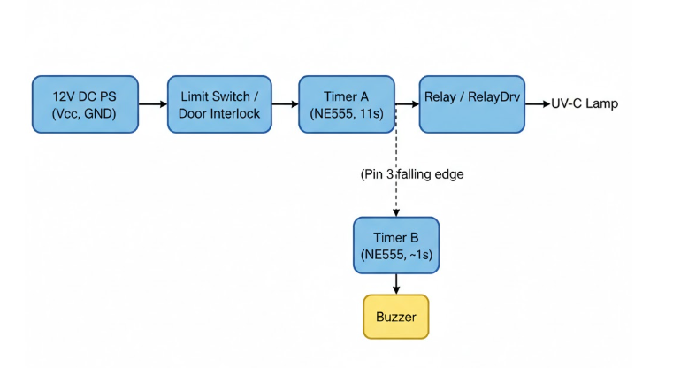
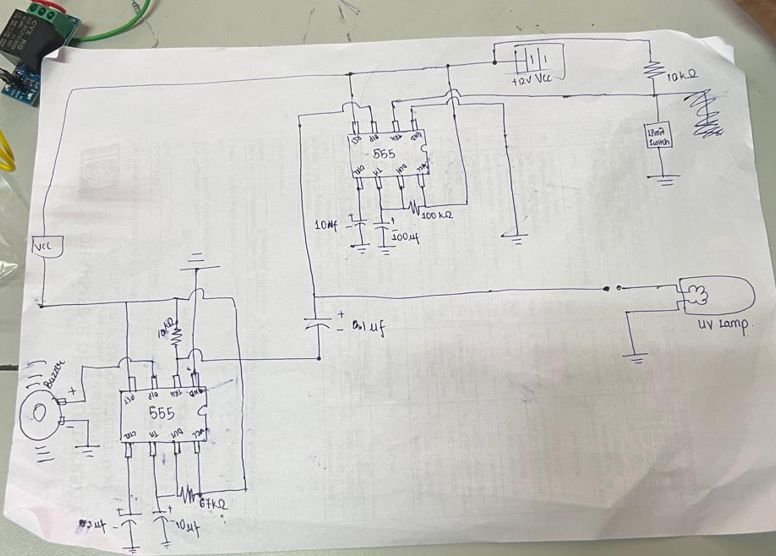
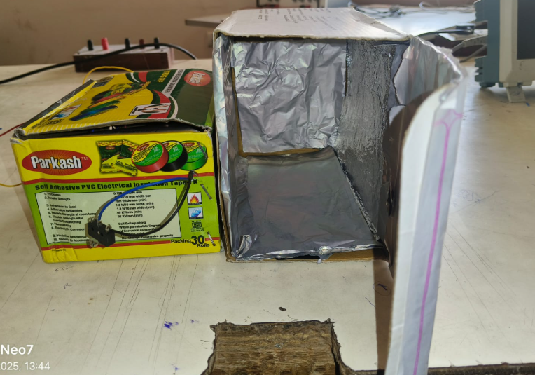
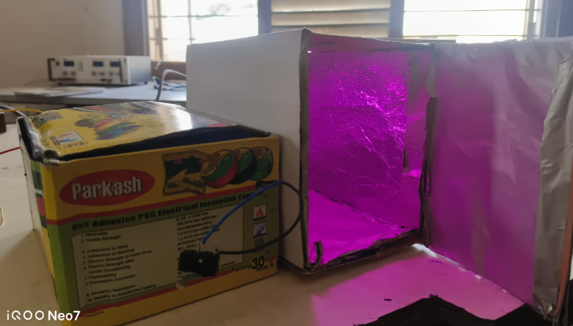

# Sustainable UV-C Hygiene Chamber

A low-cost UV-C sterilization chamber designed to promote the hygienic reuse of glass cups and reduce disposable plastic waste in institutions and workplaces.

## Problem

Disposable plastic cups are widely used in colleges, offices, and cafeterias due to convenience. However, they contribute significantly to non-biodegradable waste and environmental pollution.

Although reusable glass cups are environmentally friendly, hygiene concerns discourage their widespread use.

## Solution

This project presents a **UV-C Hygiene Chamber** that disinfects reusable glassware using germicidal UV-C light. The system ensures safe operation using a **door safety interlock and hardware-based timing control**.

The chamber automatically activates only when the door is closed and provides a buzzer alert after the sterilization cycle is completed.

---

# Block Diagram

---

# Circuit Diagram

---

# System Components

Main components used in the project:

- NE555 Timer IC (×2)
- UV-C Germicidal Lamp
- Relay / Relay Driver
- Door Limit Switch
- Buzzer
- Resistors and Capacitors
- 12V DC Power Supply
- Transistor (BC547)

---

# Working Principle

1. When the chamber door closes, the **limit switch triggers Timer A**.
2. Timer A operates in **monostable mode** and activates the UV-C lamp for approximately **11 seconds**.
3. The UV-C light disinfects the glassware placed inside the chamber.
4. When the timing cycle finishes, **Timer B is triggered**.
5. Timer B activates the **buzzer for 1–2 seconds**, indicating that sterilization is complete.

---

# Advantages

- Environmentally friendly alternative to disposable cups
- Fully automated operation
- Safe operation using door interlock
- Low-cost hardware design
- No microcontroller required

---

# Applications

- College cafeterias
- Office pantries
- Small food outlets
- Household sterilization of glassware

---

# Limitations

- UV-C only disinfects surfaces directly exposed to light
- Chamber size limits object size
- Fixed timing due to hardware design

---

# Future Improvements

Possible enhancements include:

- Microcontroller-based timing control
- LCD status display
- IoT monitoring
- UV leakage detection
- Multi-object sterilization chamber

---

# Prototype

---

# Project Report

Full project documentation is available here:

[Project Report](docs/UV_C_Hygiene_Chamber_Project_Report.pdf)

---

# Authors

Pratham Patel  
Harit Patel  

Electronics and Communication Engineering  
Dharmsinh Desai University
